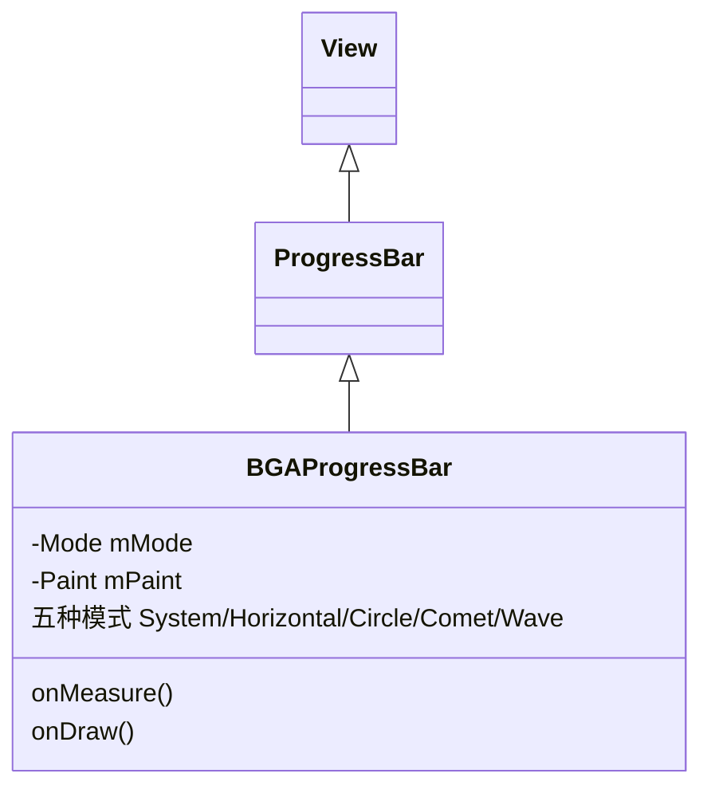
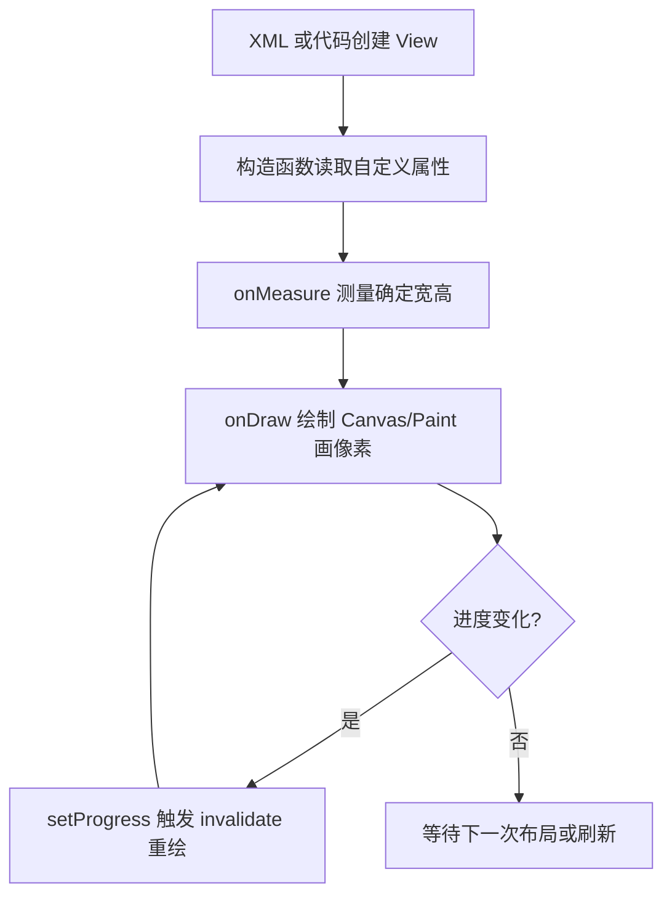
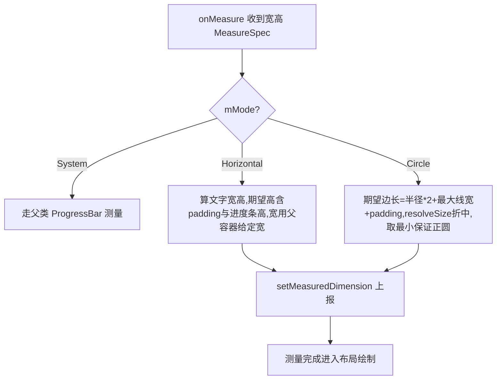
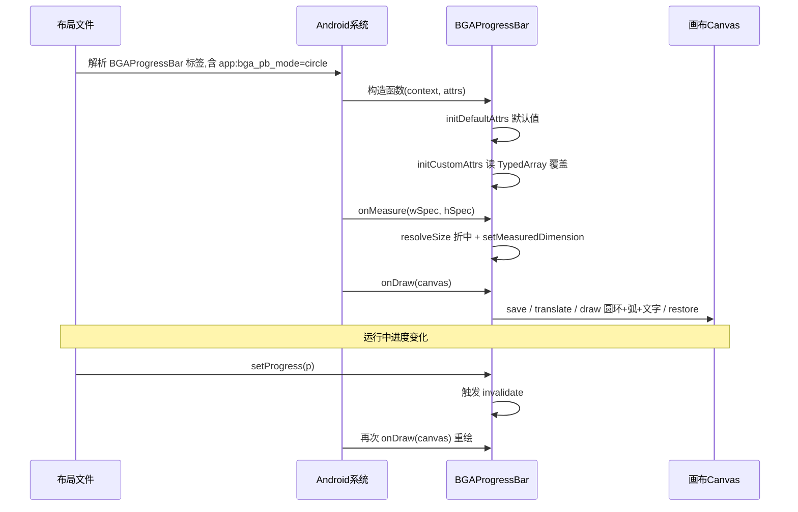

# BGAProgressBar Library 模块原理

> 目标读者：刚接触 Android 自定义 View 的校招生。
> 读完本文你应当能回答清楚「一个进度条控件是怎么被画出来的」，并且能在别的项目里照葫芦画瓢造出自己的自定义 View。

---

## 一、这个模块是什么：Android Library 模块

“Library 模块”和我们能直接装在手机上运行的“App 模块”不同：

| 对比项 | App 模块（demo） | Library 模块（library，本仓库核心） |
| --- | --- | --- |
| 编译产物 | APK（可安装的运行包） | AAR（Android Archive，即“控件包”） |
| 插件声明 | `apply plugin: 'com.android.application'` | `apply plugin: 'com.android.library'` |
| 能否独立运行 | 能 | 不能，必须被别的模块依赖 |
| 用途 | 演示 / 测试控件 | 产出可复用的 UI 控件，供多方引用 |

本仓库的结构是 **一个 library 模块 + 一个 demo 模块**：
- `library/` 里只放一个自定义控件 `cn.bingoogolapple.progressbar.BGAProgressBar`；
- `demo/` 是它的“使用说明书”，在 `activity_main.xml` 里通过 `<cn.bingoogolapple.progressbar.BGAProgressBar .../>` 直接引用，并演示了各种样式。

这样做的好处是：**控件和宿主 App 解耦**。控件可以发布到 Maven（仓库 `build.gradle` 末尾那条 `publish-aar.gradle` 就是干这个的），任何项目一句话 `implementation` 就能用。

`library/build.gradle` 的关键点：
- `namespace = 'cn.bingoogolapple.progressbar'`：Android 资源（如自定义属性）的“包名前缀”，R 类名、属性名都挂在它下面。
- `compileSdkVersion / minSdkVersion / targetSdkVersion`：编译、最低、目标 SDK 版本，集中写在 `gradle.properties` 里用变量引用。

---

## 二、整体结构一览

```
library/
└── src/main/
    ├── AndroidManifest.xml              # 空清单 <manifest/>，library 不需要声明入口
    ├── java/cn/bingoogolapple/progressbar/
    │   └── BGAProgressBar.java          # 自定义 View 的全部逻辑（约 290 行）
    └── res/values/
        └── attrs.xml                    # 自定义属性声明（布局里 app:bga_pb_xxx 的来源）
```

类继承关系（理解“为什么要继承 ProgressBar”很关键）：



**为什么继承 `ProgressBar` 而不是 `View`？** 因为进度条必然要“当前进度 progress”和“最大进度 max”这两个状态，以及 `setProgress()`/`getMax()` 等成熟 API。`ProgressBar` 已经帮我们实现好了进度值的管理、属性动画（API 级别支持的平滑过渡），我们只需在它基础上**重写“怎么画”**即可。这就是“继承复用”的典型思路：站在巨人肩膀上改外观。

---

## 三、自定义 View 四大核心步骤（重点原理）

一个自定义 View 从“被放进布局”到“显示在屏幕上”，最关键的是四个阶段：**构造 → 量尺寸(onMeasure) → 画内容(onDraw) → 刷新重画**。其中 ③ 和 ④ 是面试与实战的高频考点。



### 3.1 构造函数：属性的三段式解析

代码定义了三个构造函数，这是 Android 的标准写法：

```java
public BGAProgressBar(Context context) {
    this(context, null);                                  // 代码里 new 时走这里
}
public BGAProgressBar(Context context, AttributeSet attrs) {
    this(context, attrs, android.R.attr.progressBarStyle);// 布局里用标签时走这里
}
public BGAProgressBar(Context context, AttributeSet attrs, int defStyleAttr) {
    super(context, attrs, defStyleAttr);
    initDefaultAttrs(context);   // 先给一套默认值
    initCustomAttrs(context, attrs); // 再用 XML 里的属性覆盖默认值
    mMaxStrokeWidth = Math.max(mReachedHeight, mUnReachedHeight);
}
```

要点：
- **`AttributeSet attrs`** 就是 XML 中 `<... app:bga_pb_mode="circle" .../>` 这些属性的原始集合。
- 三个构造函数最终都汇聚到三参版本，保证“无论怎么创建，初始化逻辑只写一份”。
- 初始化顺序：先设**默认值**，再用 XML 值**覆盖**。这样即使 XML 里不写任何属性，控件也有合理外观。

### 3.2 自定义属性（attrs.xml + TypedArray）

要在布局里用 `app:bga_pb_mode="horizontal"` 这种专属属性，需要两步：

**第一步：`res/values/attrs.xml` 声明属性**

```xml
<declare-styleable name="BGAProgressBar">
    <attr name="bga_pb_mode" format="enum">
        <enum name="system" value="0"/>
        <enum name="horizontal" value="1"/>
        <enum name="circle" value="2"/>
        <enum name="comet" value="3"/>
        <enum name="wave" value="4"/>
    </attr>
    <attr name="bga_pb_textColor" format="reference|color"/>
    <attr name="bga_pb_textSize" format="dimension"/>
    ...
</declare-styleable>
```

- `declare-styleable` 的名字 **必须和类名一致**（`BGAProgressBar`），这样系统生成的 `R.styleable.BGAProgressBar_xxx` 才对得上。
- `format` 决定属性接受什么类型：`color`（颜色）、`dimension`（尺寸，如 4dp）、`boolean`、`enum`（枚举，XML 写名字、Java 拿到数字）。

**第二步：在 Java 里读取（TypedArray）**

```java
TypedArray typedArray = context.obtainStyledAttributes(attrs, R.styleable.BGAProgressBar);
// ...循环读取每个属性...
typedArray.recycle();   // 必须回收！否则影响后续复用，造成内存/性能问题
```

`TypedArray` 是系统对属性数组的“包装句柄”，用完必须 `recycle()`，这点常被漏写，是质量检查的重点。

> ⚠️ **重要坑位：自定义属性只在非 System 模式生效。**
> `bga_pb_mode` 默认是 `system`。在 System 模式下 `onDraw` 直接调用 `super.onDraw(canvas)`，由系统原生 `ProgressBar` 用 `progressDrawable`（XML 里的 `android:progressDrawable`）去画，**`bga_pb_reachedColor` / `bga_pb_textColor` / `bga_pb_radius` 等自定义属性全部被忽略**。
> 想让自定义颜色、文字、圆角生效，必须把 `app:bga_pb_mode` 显式设为 `horizontal` 或 `circle`（参考 demo 的 demo2~demo7）。demo1 故意不设 mode、只配 `progressDrawable`，就是为了演示系统原生样式。
> 一句话记忆：**`bga_pb_*` 是给“自绘模式”用的，System 模式走的是系统那套 drawable。**

### 3.3 onMeasure：决定“我有多大”（重点）

布局系统会给每个 View 一个**测量规格 `MeasureSpec`**，包含“父容器希望我多大”的信息。很多人搞不清 `onMeasure`，这里展开讲。

`onMeasure(int widthMeasureSpec, int heightMeasureSpec)` 的两个参数不是普通数字，而是**打包了“模式 + 尺寸”的 int**：
- `EXACTLY`（精确）：父容器给定了确定尺寸（如 `match_parent` 或具体 `100dp`）。
- `AT_MOST`（至多）：父容器给定了上限，View 不能超过（如 `wrap_content`）。
- `UNSPECIFIED`（无限制）：父容器不约束（如 `ScrollView` 内部）。

代码里的处理（以 Circle 模式为例）：

```java
int expectSize = mRadius * 2 + mMaxStrokeWidth + paddingLeft + paddingRight;
int width  = resolveSize(expectSize, widthMeasureSpec);   // 结合父容器限制，得出最终宽
int height = resolveSize(expectSize, heightMeasureSpec);  // 结合父容器限制，得出最终高
expectSize = Math.min(width, height);                     // 取小，保证正圆
setMeasuredDimension(expectSize, expectSize);             // 必须把结果“汇报”给系统
```

- **`resolveSize(期望尺寸, 测量规格)`**：这是 Android 提供的工具方法，它会按父容器的限制把“我们想要的”和“父容器允许的”折中，是自定义 View 处理 `wrap_content` 的标准写法。
- **最后必须调用 `setMeasuredDimension(w, h)`**，否则会抛 `IllegalStateException`。忘记这一句是新手最常见的崩溃来源。

Horizontal 模式则根据“是否隐藏文字、进度条高度、文字高度”算出期望高度，宽度直接用父容器给的尺寸。



### 3.4 onDraw：真正“画像素”（重点）

`onDraw(Canvas canvas)` 提供一块画布，我们用 `Paint`（画笔）在上面画。同样按模式分派：

```java
if (mMode == Mode.System)      super.onDraw(canvas);   // 用系统原生画法
else if (mMode == Mode.Horizontal) onDrawHorizontal(canvas);
else if (mMode == Mode.Circle)     onDrawCircle(canvas);
// Comet / Wave 还是 TODO，目前直接走系统画法
```

**`Canvas`**：相当于“画板/画布”，提供画直线(`drawLine`)、圆(`drawOval`/`drawCircle`)、弧(`drawArc`)、文字(`drawText`) 等方法。
**`Paint`**：相当于“画笔”，控制颜色(`setColor`)、线宽(`setStrokeWidth`)、填充还是描边(`setStyle`)、抗锯齿(`setAntiAlias`)、线帽圆角(`setStrokeCap(Paint.Cap.ROUND)`)、文字对齐(`setTextAlign`)。

**Horizontal 模式绘制逻辑（核心算法）**：

1. 把画布平移到“左侧内边距、垂直居中”的位置：`canvas.translate(paddingLeft, measuredHeight/2)`。
2. 计算进度比例：`reachedRatio = progress / max`，已到达的右端 X：`reachedEndX = ratio * 可用宽度`。
3. 用“已完成颜色”画左边一段线（已进度部分）。
4. 在已进度末端右侧画百分比文字（如 `40%`）。
5. 文字右侧到末尾，用“未完成颜色”画剩余线段。
6. 边界处理：进度条不能超出可用宽度；圆角模式时未进度段起点要往右挪半个线宽，避免两线段重叠出尖角。

**Circle 模式绘制逻辑**：

1. 先画一个“未完成颜色”的底层圆环（`drawCircle`，描边模式）。
2. 用 `drawArc` 画“已完成颜色”的扇形进度：扫描角度 `sweepAngle = progress/max * 360`。`drawArc` 的 `false` 表示不连圆心（只画弧，不画成饼）。
3. 圆心处画百分比文字（文字对齐设为 CENTER，坐标落在圆心附近）。

两个模式都用 `canvas.save()` / `canvas.restore()` 把“平移画布”的操作框起来，避免影响后续绘制——这是 Canvas 状态栈的标准用法（`save` 压栈、`restore` 弹栈恢复）。

> 💡 **两个工程化细节（写自定义 View 必知）：**
> 1. **`onMeasure` / `onDraw` 是 `synchronized` 的。** 这两个方法从 `ProgressBar` 继承时带了 `synchronized` 关键字，目的是保证“读进度值 `getProgress()`”和“外部 `setProgress()` 改值”之间线程安全（进度可能在子线程被更新）。你重写时保留这个同步语义即可，不要为了“性能”擅自去掉同步而导致进度值读到半成品。
> 2. **全控件只共用一支 `Paint`（`mPaint`）。** `setStrokeCap` / `setTextAlign` / `setStyle` 这些状态会**一直留在画笔上**，直到下次被改写。例如 `bga_pb_isCapRounded=true` 时把笔帽设成圆角，它会一直生效到进程结束（也影响 Circle 模式的弧线）。当你以后扩展 Comet/Wave 等新分支时，务必在每段绘制前**显式 reset 你关心的画笔状态**，否则会出现“上一模式留下的线帽/对齐/填充方式串味”的诡异 bug。

### 3.5 进度刷新：invalidate 机制（重点）

控件显示后，外部通过 `setProgress(progress)` 改变进度。这里藏着自定义 View 刷新机制的考点：

- `ProgressBar.setProgress()` 内部修改进度值后，会触发 **`invalidate()`**——它向 View 树请求“重绘我自己”。
- 系统随后会再次调用 `onDraw`，用新进度重新画一遍。
- 因为只改了“画的内容”而没改“尺寸”，所以**不需要重测**，只需重绘。

> 补充记忆点（常见辨析）：
> - `invalidate()` → 只触发 `onDraw`，用于“内容变了但尺寸不变”（如进度变化）。
> - `requestLayout()` → 触发 `onMeasure` + `onLayout` + `onDraw`，用于“尺寸或位置变了”（如改了圆角、半径等影响大小的因素）。
> 本控件改属性后若影响尺寸，应配合 `requestLayout()`；单纯进度变化用 `invalidate()` 足够。

---

## 四、文字测量：为什么需要 `calculateTextWidthAndHeight()`

文字不像线条，它“占多大地方”必须靠 `Paint` 去量。代码里用 `mPaint.getTextBounds(text, 0, len, mTextRect)` 把文字的边界框算出来，得到 `mTextWidth / mTextHeight`。

```java
mText = String.format("%d", (int)(getProgress() * 1.0f / getMax() * 100)) + "%";
mPaint.getTextBounds(mText, 0, mText.length(), mTextRect);
mTextWidth  = mTextRect.width();
mTextHeight = mTextRect.height();
```

> 注释里特别标注了一次修复：**先乘 1.0f 转成浮点再除，避免整数相除精度丢失**（老代码 `getProgress()*100/getMax()` 在进度很小时会被整除成 0）。这是“整数运算陷阱”的经典案例，校招生写计算逻辑时务必警惕。
> 顺带一个健壮性提醒：若 `getMax()` 返回 0（极端情况下 `setMax(0)`），`* 1.0f / getMax()` 会得到 `NaN/Infinity`，`String.format("%d", ...)` 会输出 `"0"` 之外的异常串。生产代码里通常应兜底 `max = Math.max(getMax(), 1)`。本仓库 demo 都把 max 设为 100/200，未触发该问题，但“除以可能为 0 的分母”是自定义 View 计算里要养成的防御习惯。

---

## 五、dp 与 sp：屏幕适配的两种单位

Android 不同设备像素密度不同，不能直接写 px。代码提供了两个工具方法：

```java
public static int dp2px(Context context, float dpValue) {
    return (int) TypedValue.applyDimension(TypedValue.COMPLEX_UNIT_DIP, dpValue,
            context.getResources().getDisplayMetrics());
}
public static int sp2px(Context context, float spValue) {
    return (int) TypedValue.applyDimension(TypedValue.COMPLEX_UNIT_SP, spValue,
            context.getResources().getDisplayMetrics());
}
```

- **dp**（density-independent pixel）：与屏幕密度无关的长度单位，控件尺寸用 dp。
- **sp**（scale-independent pixel）：在 dp 基础上还受系统“字体大小”设置影响，文字大小用 sp。
- `TypedValue.applyDimension` 会根据设备 `DisplayMetrics` 把 dp/sp 换算成真实像素 px。

本控件的默认值（文字 10sp、已完成高度 2dp、半径 16dp 等）正是用这两个方法从“设计稿单位”转成“屏幕像素”。

---

## 六、完整生命周期与刷新流程图



---

## 七、举一反三：如何改造成你自己的进度条

理解了以上原理，你完全可以照此套路造新控件。迁移/改造清单：

1. **新建类继承 `ProgressBar`**（或 `View`/`ViewGroup`，取决于是否需要复用进度逻辑）。
2. **定义 `attrs.xml`**：列出你要暴露的样式属性（`declare-styleable` 名与类名一致）。
3. **三参构造函数 + 默认值 + TypedArray 读取 + recycle()**。
4. **重写 `onMeasure`**：用 `resolveSize` 处理 `wrap_content`，最后 `setMeasuredDimension`。
5. **重写 `onDraw`**：`Paint` 设样式、`Canvas` 用 `save/restore` 包裹、`drawLine/drawArc/drawText` 实现外观。
6. **刷新**：改内容用 `invalidate()`，改尺寸用 `requestLayout()`。
7. **单位**：尺寸用 dp2px，文字用 sp2px，保证多设备适配。
8. 发布成 library 模块，通过 `implementation` 让其他项目引用。

> 本仓库的 `Comet`（彗星）和 `Wave`（水波纹）两种模式目前还是 `// TODO`，在 `onMeasure`/`onDraw` 里直接走了系统画法。它们正是留给你的练手位：参照 `Horizontal`/`Circle` 的模式分派结构，把对应分支补全即可。

---

## 附：面试高频考点速记

### 一、速记口诀

> **量布画，三步走** —— `onMeasure`(量尺寸) / `onLayout`(定位置，ViewGroup 用) / `onDraw`(画内容)。
>
> **wrap 不生效，量己再上报** —— `wrap_content` 必须在 `onMeasure` 里用 `resolveSize` 算期望尺寸，并调用 `setMeasuredDimension` 把结果“上报”给系统，否则会被当成 0 或 match_parent。
>
> **改内容 invalidate，改尺寸 requestLayout** —— 只动外观用 `invalidate()`（重走 onDraw）；动了大小/位置用 `requestLayout()`（重走 measure→layout→draw）。
>
> **属性三步：声明 → 读取 → 回收** —— `attrs.xml` 里 `declare-styleable` 声明，`obtainStyledAttributes` 读取，读完后务必 `recycle()`。
>
> **画布 save/restore，像快照还原** —— `save()` 压栈保存平移/旋转状态，`restore()` 弹栈还原，防止状态串味污染后续绘制。
>
> **字 sp 余 dp** —— 文字大小用 `sp`（随系统字号变），其余尺寸用 `dp`（只随屏幕密度变）。
>
> **整数运算先乘 1.0f** —— `getProgress()*100/getMax()` 会整除丢精度，先 `*1.0f` 转浮点再除。

### 二、高频问答（自测）

下面 8 题覆盖本控件涉及的自定义 View 核心点，合上文档自答，再对照答案查漏。

**Q1：自定义 View 的生命周期里，哪三个方法是核心？各自职责是什么？**
A：`onMeasure`（测量自身宽高）、`onLayout`（确定子 View 位置，仅 ViewGroup 需重写）、`onDraw`（把内容画到 Canvas 上）。本控件只重写前两者中的 onMeasure 与 onDraw。

**Q2：为什么在 XML 里写 `android:layout_width="wrap_content"` 后，自定义 View 仍占满父容器或高度为 0？**
A：因为没重写 `onMeasure` 给出“期望尺寸”。系统对 `wrap_content` 默认按 `AT_MOST` 处理，若你直接调父类或没 `setMeasuredDimension`，就会退化成 match_parent 或 0。正确做法是用 `resolveSize(期望尺寸, measureSpec)` 折中后 `setMeasuredDimension(w, h)`。

**Q3：`invalidate()` 和 `requestLayout()` 的区别？本控件进度变化走哪个？**
A：`invalidate()` 只触发 `onDraw`（内容变了、尺寸没变）；`requestLayout()` 触发 `onMeasure + onLayout + onDraw`（尺寸/位置变了）。进度变化只改“画的内容”，所以走 `invalidate()`（由 `ProgressBar.setProgress()` 内部触发）。

**Q4：自定义属性从声明到使用，完整链路是什么？**
A：① `res/values/attrs.xml` 用 `<declare-styleable name="类名">` + `<attr>` 声明（名字须与类名一致）；② 布局里用 `xmlns:app=".../res-auto"` 后写 `app:bga_pb_xxx`；③ Java 构造函数里 `obtainStyledAttributes` 读取，读完 `recycle()`。

**Q5：`Canvas.save()` / `restore()` 解决什么问题？本控件哪里用到了？**
A：保存并恢复画布变换状态（平移、旋转、缩放），避免一次绘制的状态“泄漏”到后续绘制。本控件在 `onDrawHorizontal`/`onDrawCircle` 里用 `canvas.save()` 平移画布居中、画完 `canvas.restore()` 还原。

**Q6：dp 和 sp 有什么不同？分别用在哪？**
A：`dp` 与屏幕密度无关（同 dp 在不同密度屏物理大小一致）；`sp` 在 dp 基础上还受系统“字体大小”设置影响。规则：**文字用 sp（如本控件文字 10sp），其余尺寸用 dp（如已完成高度 2dp、半径 16dp）**。

**Q7：本控件用 `getProgress() * 1.0f / getMax() * 100` 算百分比，为什么不直接写 `getProgress() * 100 / getMax()`？**
A：后者是整数相除，进度很小时会被整除成 0（如进度 1、max 200 → 100/200=0）。先乘 `1.0f` 把运算提升为浮点，再除可得正确小数，最后 `(int)` 取整拼成 `"40%"`。

**Q8：为什么给 `BGAProgressBar` 设了 `bga_pb_reachedColor` 等自定义属性却没生效？**
A：因为 `bga_pb_mode` 默认是 `system`，此时 `onDraw` 走 `super.onDraw()`，由系统 `ProgressBar` 用 `progressDrawable` 渲染，**自定义颜色/文字/圆角属性全部被忽略**。必须把 `app:bga_pb_mode` 显式设为 `horizontal` 或 `circle` 才会走自绘逻辑、应用这些属性。

---

**自测评分标准**：能流畅答出 Q1–Q6 算“基础过关”；Q7（整数精度）、Q8（System 模式坑）属于易忽略的加分项，能答出说明真正读透了源码。
